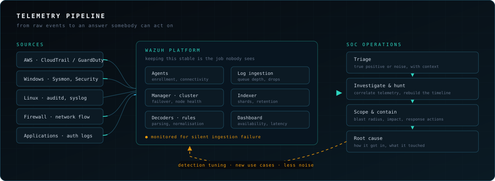

  

  
  

 

## About

I design and secure cloud environments, and keep the monitoring platform itself healthy —
then step into investigations when something real comes through.

I started on the analyst side: triaging alerts, separating true positives from noise,
rebuilding attack timelines out of raw Windows, Linux, firewall and cloud logs. That
background shapes how I build. A detection nobody can act on at 3am isn't finished, and
a monitoring stack that silently stops ingesting is worse than no stack at all.

  

 

## How the pieces fit together

The work spans the whole path from a raw event to a decision. Below is the shape of it —
sources on the left, the platform that has to stay up in the middle, and the operations
that depend on it on the right. The amber line is the part people forget: what an
investigation teaches you goes back into the detection logic.

  

 

## What I work on

<table>
<tr>
<td width="50%" valign="top">

**☁️ Cloud Security Engineering**

Secure architecture, configuration and implementation across AWS. Technical guidance on
secure design and troubleshooting.

</td>
<td width="50%" valign="top">

**🧰 Platform Reliability**

Keeping Wazuh available and stable — Manager, Indexer, Dashboard, clustering, log
ingestion, integrations and performance.

</td>
</tr>
<tr>
<td width="50%" valign="top">

**🔍 Incident Response & Threat Hunting**

Scoping compromises, validating evidence, root-cause and attack-path analysis across
endpoint, network, authentication and SIEM telemetry.

</td>
<td width="50%" valign="top">

**📈 Detection Engineering**

Building and tuning detection use cases, cutting alert noise, widening monitoring
coverage and improving investigation workflows.

</td>
</tr>
</table>

 

## Stack

  
  
  
  
  
  

  
  
  
  
  
  

 

## Currently

Setting this space up to publish detection logic, cloud hardening notes and small
operational tools from day-to-day work. More here soon.

 

---

Views and repositories here are my own and do not represent my employer.

